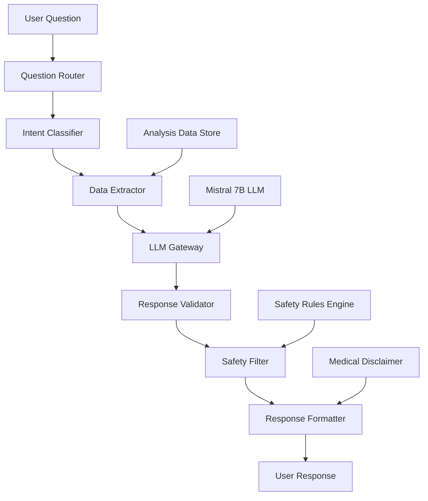
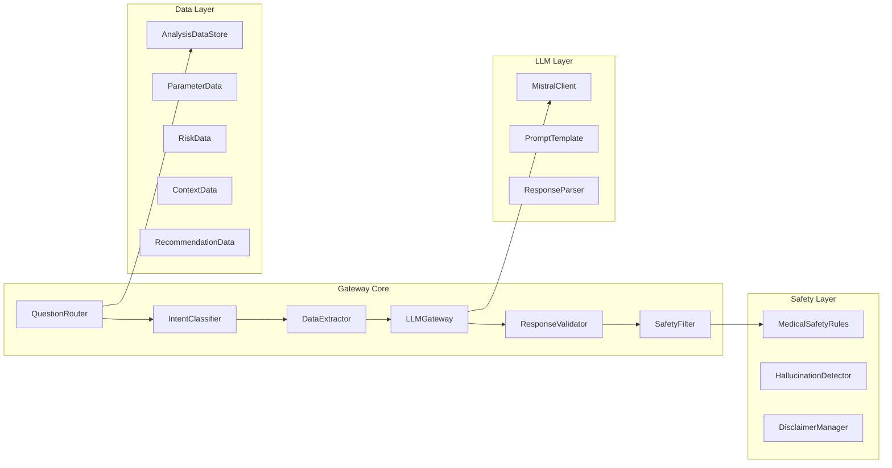

# Design Document

## Overview

The Data-Grounded Question-Answering Gateway is a constrained LLM system that provides natural language Q&A capabilities for blood report analysis results. The system uses Mistral 7B Instruct model to process user questions while maintaining strict data grounding to prevent hallucination and enforce medical safety rules.

The gateway acts as an intelligent interface layer between users and their medical analysis data, translating complex medical analysis results into patient-friendly explanations while never going beyond the scope of the provided data.

## Architecture

### High-Level Architecture



### Component Architecture



## Components and Interfaces

### 1. QuestionRouter

**Purpose**: Routes incoming questions to appropriate processing pipelines based on question type and available data.

**Interface**:
```python
class QuestionRouter:
    def route_question(self, question: str, available_data: Dict) -> RouteInfo
    def get_available_topics(self, analysis_data: Dict) -> List[str]
    def validate_question_scope(self, question: str) -> bool
```

**Responsibilities**:
- Classify question types (parameter, risk, context, recommendation, general)
- Determine data availability for answering questions
- Provide topic suggestions based on available data
- Filter out-of-scope questions

### 2. IntentClassifier

**Purpose**: Uses keyword matching and pattern recognition to understand user intent and extract relevant entities.

**Interface**:
```python
class IntentClassifier:
    def classify_intent(self, question: str) -> Intent
    def extract_entities(self, question: str) -> List[Entity]
    def get_confidence_score(self, classification: Intent) -> float
```

**Intent Types**:
- `PARAMETER_QUERY`: Questions about specific test values
- `RISK_ASSESSMENT`: Questions about risk levels and concerns
- `CONTEXTUAL_INFO`: Questions about age/gender context
- `RECOMMENDATIONS`: Questions about lifestyle advice
- `GENERAL_STATUS`: Questions about overall health status

### 3. DataExtractor

**Purpose**: Extracts relevant data from analysis results based on classified intent and entities.

**Interface**:
```python
class DataExtractor:
    def extract_parameter_data(self, entities: List[Entity], analysis_data: Dict) -> Dict
    def extract_risk_data(self, analysis_data: Dict) -> Dict
    def extract_context_data(self, analysis_data: Dict) -> Dict
    def extract_recommendation_data(self, analysis_data: Dict) -> Dict
    def validate_data_availability(self, required_data: List[str], analysis_data: Dict) -> bool
```

### 4. LLMGateway

**Purpose**: Interfaces with Mistral 7B Instruct model to generate natural language responses based on extracted data.

**Interface**:
```python
class LLMGateway:
    def __init__(self, ollama_url: str = "http://localhost:11434")
    def generate_response(self, prompt: str, system_prompt: str, data_context: Dict) -> str
    def validate_llm_availability(self) -> bool
    def configure_model_parameters(self, temperature: float, max_tokens: int) -> None
```

**Model Configuration**:
- Model: `mistral:instruct`
- Temperature: 0.1 (low for consistency)
- Max tokens: 500 (concise responses)
- Top-p: 0.9 (focused sampling)

### 5. ResponseValidator

**Purpose**: Validates that LLM responses are grounded in the provided data and contain no hallucinated information.

**Interface**:
```python
class ResponseValidator:
    def validate_response(self, response: str, source_data: Dict) -> ValidationResult
    def check_data_grounding(self, response: str, source_data: Dict) -> bool
    def detect_hallucination(self, response: str, source_data: Dict) -> List[str]
    def verify_medical_accuracy(self, response: str) -> bool
```

### 6. SafetyFilter

**Purpose**: Enforces medical safety rules and prevents inappropriate medical advice.

**Interface**:
```python
class SafetyFilter:
    def apply_safety_rules(self, response: str) -> FilterResult
    def check_diagnosis_content(self, response: str) -> bool
    def check_medication_content(self, response: str) -> bool
    def enforce_disclaimer_requirement(self, response: str) -> str
```

**Safety Rules**:
- No disease diagnosis
- No medication recommendations
- No treatment advice
- No predictions about health outcomes
- Mandatory medical disclaimer

### 7. AnalysisDataStore

**Purpose**: Manages and provides access to medical analysis data from Phase-1 and Phase-2 processing.

**Interface**:
```python
class AnalysisDataStore:
    def load_analysis_data(self, analysis_result: Dict) -> None
    def get_parameter_interpretations(self) -> List[Dict]
    def get_risk_assessment(self) -> Dict
    def get_contextual_analysis(self) -> Dict
    def get_recommendations(self) -> Dict
    def get_synthesis_data(self) -> Dict
```

## Data Models

### Question Processing Models

```python
@dataclass
class Intent:
    type: str  # PARAMETER_QUERY, RISK_ASSESSMENT, etc.
    confidence: float
    entities: List[str]
    data_requirements: List[str]

@dataclass
class Entity:
    text: str
    type: str  # PARAMETER_NAME, VALUE, STATUS, etc.
    confidence: float

@dataclass
class RouteInfo:
    handler: str
    data_sources: List[str]
    processing_priority: int
```

### Response Models

```python
@dataclass
class ValidationResult:
    is_valid: bool
    confidence: float
    issues: List[str]
    data_sources: List[str]

@dataclass
class FilterResult:
    is_safe: bool
    filtered_response: str
    violations: List[str]
    disclaimer_added: bool

@dataclass
class GatewayResponse:
    answer: str
    confidence: float
    data_sources: List[str]
    processing_time: float
    disclaimer: str
```

### Analysis Data Models

```python
@dataclass
class ParameterInterpretation:
    test_name: str
    value: str
    classification: str  # Low, Normal, High, Borderline
    reference_range: str
    confidence: float

@dataclass
class RiskAssessment:
    overall_risk_level: str  # Low, Moderate, High
    reasoning: str
    key_concerns: List[str]
    pattern_significance: str

@dataclass
class ContextualAnalysis:
    context_status: str
    demographic_info: Dict
    context_notes: List[str]
    age_extracted: bool
    gender_extracted: bool
```

## Correctness Properties

*A property is a characteristic or behavior that should hold true across all valid executions of a system-essentially, a formal statement about what the system should do. Properties serve as the bridge between human-readable specifications and machine-verifiable correctness guarantees.*

Now I need to analyze the acceptance criteria to determine which ones are testable as properties:

### Property Reflection

After analyzing all acceptance criteria, I identified several areas where properties can be consolidated to eliminate redundancy while maintaining comprehensive coverage:

- **Data Grounding**: Properties 1.1, 2.1, 2.2, 2.3 all test the core concept that responses must be grounded in analysis data
- **Question Routing**: Properties 7.1-7.4 test the same routing mechanism for different question types
- **Data Extraction**: Properties 4.3-4.5 test the same extraction mechanism for different data sources
- **Safety Rules**: Properties 3.1-3.4 test different aspects of medical safety compliance
- **LLM Availability**: Properties 6.1-6.2 test availability handling
- **Configuration**: Properties 9.1, 9.2, 9.4 test different aspects of the same configuration system

### Correctness Properties

Property 1: Data Grounding Compliance
*For any* user question and analysis data, all content in the generated response must be traceable to specific data points in the analysis data, with no external information or hallucinated content
**Validates: Requirements 1.1, 2.1, 2.2, 2.3, 2.5**

Property 2: Unavailable Information Handling
*For any* question that cannot be answered from the available analysis data, the system should respond with the exact message "This information is not available in your blood report analysis."
**Validates: Requirements 1.3, 2.4**

Property 3: Medical Disclaimer Inclusion
*For any* generated response, the medical disclaimer must be appended to ensure medical safety compliance
**Validates: Requirements 1.4**

Property 4: Medical Safety Compliance
*For any* generated response, the content must not contain disease diagnoses, medication prescriptions, treatment advice, or predictions about future health outcomes
**Validates: Requirements 3.1, 3.2, 3.3, 3.4**

Property 5: Data Structure Compatibility
*For any* analysis data structure (Phase-1 only or Phase-2 complete), the gateway should successfully extract and utilize all available data sections (parameters, risk assessment, contextual analysis, recommendations)
**Validates: Requirements 4.1, 4.2, 4.3, 4.4, 4.5**

Property 6: Question Processing Capability
*For any* valid text input, the gateway should process the question and either provide a data-grounded response or indicate information unavailability
**Validates: Requirements 5.1**

Property 7: Topic Availability Accuracy
*For any* analysis data, the list of available topics should accurately reflect what can be answered from the data, with topics changing appropriately when data content changes
**Validates: Requirements 5.3, 5.4**

Property 8: LLM Availability Handling
*For any* LLM availability state (available or unavailable), the gateway should behave appropriately - using the LLM when available or providing fallback messages when unavailable
**Validates: Requirements 6.1, 6.2, 6.3, 6.4**

Property 9: Question Routing Accuracy
*For any* question about parameters, risk levels, demographic context, or recommendations, the system should route to the appropriate data source and extract relevant information
**Validates: Requirements 7.1, 7.2, 7.3, 7.4**

Property 10: Audit Trail Completeness
*For any* question-response interaction, the system should log the question, response, data sources used, timestamp, and confidence indicators for compliance tracking
**Validates: Requirements 8.1, 8.2, 8.3, 8.4, 8.5**

Property 11: Configuration Flexibility
*For any* valid LLM configuration (different endpoints, models, or parameters), the gateway should validate the configuration and maintain consistent behavior while adapting to the new settings
**Validates: Requirements 9.1, 9.2, 9.3, 9.4, 9.5**

Property 12: Concurrent Processing Integrity
*For any* set of concurrent questions from different users, the system should process them without session interference, maintain response accuracy, handle timeouts appropriately, and provide performance metrics
**Validates: Requirements 10.1, 10.2, 10.3, 10.4, 10.5**

Property 13: Safety Validation Enforcement
*For any* LLM-generated response, the system should validate the response for safety compliance before returning it to the user
**Validates: Requirements 6.5**

## Error Handling

### LLM Connection Errors
- **Timeout Handling**: 30-second timeout for LLM requests with graceful fallback
- **Connection Failures**: Clear error messages with troubleshooting guidance
- **Model Unavailability**: Fallback to rule-based responses when possible

### Data Validation Errors
- **Missing Analysis Data**: Clear indication of what data is required
- **Malformed Data**: Graceful handling with partial functionality
- **Schema Mismatches**: Automatic adaptation where possible

### Question Processing Errors
- **Ambiguous Questions**: Request clarification or provide general guidance
- **Out-of-Scope Questions**: Clear boundary communication
- **Malformed Input**: Input sanitization and error recovery

### Safety Violations
- **Hallucination Detection**: Automatic response rejection and regeneration
- **Medical Safety Breaches**: Immediate filtering and safe response substitution
- **Compliance Failures**: Audit logging and administrative alerts

## Testing Strategy

### Dual Testing Approach

The system will be validated using both unit tests and property-based tests to ensure comprehensive coverage:

**Unit Tests** will focus on:
- Specific question-answer examples for each data type
- Edge cases like empty data, malformed questions, and LLM failures
- Integration points between components
- Error handling scenarios and fallback behaviors

**Property-Based Tests** will focus on:
- Universal properties that hold across all inputs and data combinations
- Data grounding compliance across randomly generated questions and analysis data
- Safety rule enforcement across diverse response content
- Configuration flexibility across different LLM setups

### Property-Based Testing Configuration

- **Testing Framework**: Hypothesis (Python) for property-based testing
- **Test Iterations**: Minimum 100 iterations per property test
- **Test Data Generation**: Smart generators for medical analysis data, user questions, and system configurations
- **Coverage Requirements**: Each correctness property must be implemented as a single property-based test

### Test Tag Format

Each property test will be tagged with:
**Feature: data-grounded-qa-gateway, Property {number}: {property_text}**

Example:
```python
@given(question=medical_questions(), analysis_data=analysis_data_generator())
def test_data_grounding_compliance(question, analysis_data):
    """Feature: data-grounded-qa-gateway, Property 1: Data Grounding Compliance"""
    # Test implementation
```

### Testing Priorities

1. **Critical Path Testing**: Data grounding and medical safety properties
2. **Integration Testing**: End-to-end question processing workflows
3. **Performance Testing**: Concurrent request handling and response times
4. **Compliance Testing**: Audit trail completeness and safety validation

The testing strategy ensures that the gateway maintains strict medical safety standards while providing reliable, data-grounded responses across all usage scenarios.