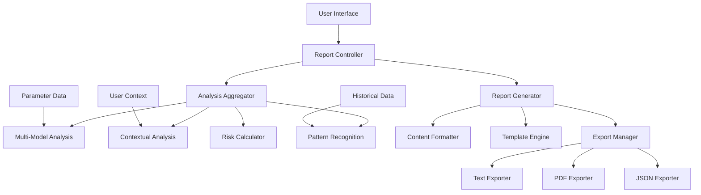

# Design Document

## Overview

The enhanced report download feature transforms the current basic parameter export into a comprehensive medical analysis report. The system will integrate all existing analysis capabilities - multi-model AI analysis, risk assessment, personalized recommendations, and contextual insights - into structured, downloadable reports. This design leverages the existing analysis infrastructure while adding new report generation and formatting components.

## Architecture

The enhanced report system follows a modular architecture that integrates with existing analysis components:



## Components and Interfaces

### Report Controller
**Purpose**: Orchestrates the report generation process and manages user requests.

**Key Methods**:
- `generate_comprehensive_report(report_data, user_context, format_type)`: Main entry point for report generation
- `validate_analysis_completeness(analysis_results)`: Ensures all available analysis is included
- `determine_report_sections(analysis_results)`: Decides which sections to include based on available data

**Dependencies**: Analysis Aggregator, Report Generator, User Context Manager

### Analysis Aggregator
**Purpose**: Collects and consolidates all analysis results from different AI models and components.

**Key Methods**:
- `collect_all_analysis(report_data, user_context)`: Gathers results from all analysis engines
- `perform_multi_model_analysis(report_data)`: Executes the existing multi-model analysis
- `perform_contextual_analysis(report_data, user_context)`: Runs contextual analysis with user profile
- `calculate_advanced_risks(report_data, user_context)`: Computes risk scores and assessments
- `identify_patterns_and_correlations(report_data)`: Finds parameter correlations and medical patterns

**Data Structures**:
```python
AnalysisResults = {
    'multi_model_analysis': MultiModelResults,
    'contextual_analysis': ContextualResults,
    'risk_assessment': RiskResults,
    'pattern_recognition': PatternResults,
    'completeness_score': float,
    'analysis_timestamp': datetime
}
```

### Report Generator
**Purpose**: Creates structured reports from analysis results using templates and formatting rules.

**Key Methods**:
- `create_comprehensive_report(analysis_results, format_type)`: Generates complete report
- `build_executive_summary(analysis_results)`: Creates high-level summary section
- `format_risk_assessment_section(risk_data)`: Formats risk scores and explanations
- `format_recommendations_section(recommendations)`: Organizes recommendations by category and priority
- `add_traceability_chains(recommendations)`: Links recommendations to supporting evidence

**Template Structure**:
```
1. Executive Summary
2. Patient Context
3. Parameter Analysis
4. Risk Assessment
5. Pattern Recognition
6. Personalized Recommendations
7. Traceability Evidence
8. Completeness Report
```

### Content Formatter
**Purpose**: Handles format-specific styling and structure for different export types.

**Key Methods**:
- `format_for_text(content)`: Creates readable text format with proper spacing and headers
- `format_for_pdf(content)`: Applies PDF-specific formatting with tables and charts
- `format_for_json(content)`: Structures data for JSON export with proper nesting
- `apply_medical_formatting(content)`: Adds medical document conventions and terminology

### Export Manager
**Purpose**: Manages the actual file generation and download process for different formats.

**Key Methods**:
- `export_as_text(formatted_content, filename)`: Creates downloadable text file
- `export_as_pdf(formatted_content, filename)`: Generates PDF with proper medical document formatting
- `export_as_json(structured_data, filename)`: Creates JSON file for technical users
- `generate_filename(report_data, format_type)`: Creates descriptive filenames with timestamps

## Data Models

### Comprehensive Report Structure
```python
class ComprehensiveReport:
    def __init__(self):
        self.executive_summary = ExecutiveSummary()
        self.patient_context = PatientContext()
        self.parameter_analysis = ParameterAnalysis()
        self.risk_assessment = RiskAssessment()
        self.pattern_recognition = PatternRecognition()
        self.recommendations = RecommendationsList()
        self.traceability = TraceabilityChains()
        self.completeness = CompletenessReport()
        self.metadata = ReportMetadata()

class ExecutiveSummary:
    overall_health_score: float
    critical_findings: List[str]
    priority_recommendations: List[str]
    risk_level: str
    key_patterns: List[str]

class RiskAssessment:
    anemia_risk: RiskScore
    infection_risk: RiskScore
    bleeding_risk: RiskScore
    cardiovascular_risk: RiskScore
    overall_risk: RiskScore
    combined_risk_scenarios: List[CombinedRisk]

class RiskScore:
    score: float  # 0-100
    level: str    # Low/Moderate/High
    contributing_factors: List[str]
    calculation_method: str
    confidence: float

class RecommendationWithTraceability:
    category: str
    priority: str  # High/Medium/Low
    actions: List[str]
    traceability: TraceabilityChain
    expected_impact: str
    timeline: str

class TraceabilityChain:
    finding: str
    risk_calculation: str
    reasoning: str
    supporting_parameters: List[str]
    confidence_level: float
```

### Report Format Specifications

**Text Format**:
- Clean, readable layout with ASCII art headers
- Tabular data presentation for parameters
- Bullet points for recommendations
- Clear section separators
- Monospace formatting for data alignment

**PDF Format**:
- Professional medical document styling
- Charts and graphs for risk scores
- Color-coded severity indicators
- Proper medical document headers and footers
- Table formatting for parameter data

**JSON Format**:
- Structured data with nested objects
- Programmatic access to all analysis results
- Standardized field names for integration
- Metadata for version control and timestamps

## Error Handling

### Analysis Failure Recovery
- **Partial Analysis**: If some analysis models fail, include available results and note limitations
- **Missing Context**: When user context is incomplete, provide general analysis and note personalization limitations
- **Data Quality Issues**: Validate parameter data quality and flag potential OCR errors
- **Timeout Handling**: Implement timeouts for analysis operations with graceful degradation

### Export Error Management
- **File Generation Failures**: Provide alternative formats if primary format fails
- **Large Report Handling**: Implement pagination or compression for very large reports
- **Format Compatibility**: Validate format compatibility before generation
- **Download Failures**: Provide retry mechanisms and alternative delivery methods

## Testing Strategy

The testing approach combines unit tests for individual components and property-based tests for comprehensive validation.

### Unit Testing Focus
- Template rendering accuracy
- Format-specific output validation
- Error handling scenarios
- File generation and download mechanics
- Integration with existing analysis components

### Property-Based Testing Configuration
Using pytest with Hypothesis library, minimum 100 iterations per property test.
Each test tagged with: **Feature: enhanced-report-download, Property {number}: {property_text}**

## Correctness Properties

*A property is a characteristic or behavior that should hold true across all valid executions of a system-essentially, a formal statement about what the system should do. Properties serve as the bridge between human-readable specifications and machine-verifiable correctness guarantees.*

### Property 1: Complete Analysis Integration
*For any* report generation request with available analysis data, the generated report should contain all analysis components that were successfully computed (multi-model analysis, risk assessment, pattern recognition, contextual insights).
**Validates: Requirements 1.1, 1.2, 1.3, 1.4, 1.5**

### Property 2: Structured Report Organization
*For any* generated report, the content should be organized into clearly defined sections with proper headers, and all data should be presented in the appropriate section with correct formatting.
**Validates: Requirements 2.1, 2.5**

### Property 3: Comprehensive Risk Score Presentation
*For any* risk assessment data, the report should present both numerical scores and severity levels, along with calculation methodology and contributing factors.
**Validates: Requirements 2.2, 4.2**

### Property 4: Recommendation Organization and Traceability
*For any* set of recommendations, they should be grouped by category with priority levels, and each recommendation should include its complete traceability chain linking findings to actions.
**Validates: Requirements 2.3, 2.4, 4.1, 4.5**

### Property 5: Contextual Personalization Integration
*For any* user context data (age, gender, medical history, lifestyle), when available, the report should include personalized risk adjustments, condition-specific insights, and demographic-based interpretations.
**Validates: Requirements 3.1, 3.2, 3.3, 3.5**

### Property 6: Combined Risk Scenario Detection
*For any* analysis results with multiple elevated risk factors, the report should identify and highlight combined risk scenarios with appropriate severity assessment.
**Validates: Requirements 3.4**

### Property 7: Pattern Documentation Completeness
*For any* identified patterns or correlations, the report should list the specific parameters involved and show deviation percentages from normal ranges where applicable.
**Validates: Requirements 4.3, 4.4**

### Property 8: Cross-Format Content Consistency
*For any* report content generated in multiple formats (text, PDF, JSON), the core analysis information should be equivalent across all formats while maintaining format-appropriate styling.
**Validates: Requirements 5.4, 5.5**

### Property 9: Completeness Indication and Error Handling
*For any* report generation with incomplete analysis data, missing user context, or partial failures, the report should clearly indicate limitations and include a completeness percentage.
**Validates: Requirements 6.1, 6.2, 6.3, 6.4, 6.5**

### Property 10: Historical Data Integration
*For any* report generation with available historical data, the report should include trend analysis, highlight significant changes, and maintain traceability to source reports with specific timeframes.
**Validates: Requirements 7.1, 7.2, 7.3, 7.4, 7.5**

## Error Handling

### Analysis Integration Failures
- **Partial Analysis Results**: When some analysis models fail, include available results and clearly indicate which analyses are missing or limited
- **Data Quality Issues**: Validate input data quality and flag potential issues that might affect analysis accuracy
- **Context Validation**: Verify user context data completeness and validity before applying personalization

### Report Generation Failures
- **Template Rendering Errors**: Implement fallback templates and graceful degradation when primary templates fail
- **Format Export Failures**: Provide alternative formats when primary format generation fails
- **Large Report Handling**: Implement pagination or compression for reports that exceed size limits
- **Content Validation**: Verify report completeness and accuracy before making available for download

### User Experience Error Handling
- **Download Failures**: Provide retry mechanisms and alternative delivery methods
- **Format Compatibility**: Validate format compatibility with user's system before generation
- **Progress Indication**: Show progress during report generation for large or complex reports
- **Timeout Management**: Implement reasonable timeouts with user notification for long-running operations

## Testing Strategy

The testing approach combines unit tests for specific functionality and property-based tests for comprehensive validation across all input variations.

### Unit Testing Focus
- Template rendering accuracy for each report section
- Format-specific output validation (text, PDF, JSON)
- Error handling scenarios and graceful degradation
- Integration with existing analysis components
- File generation and download mechanics
- Content validation and completeness checking

### Property-Based Testing Configuration
Using pytest with Hypothesis library for Python, minimum 100 iterations per property test.
Each property test tagged with: **Feature: enhanced-report-download, Property {number}: {property_text}**

**Test Data Generation Strategy**:
- Generate realistic blood parameter data with various abnormal patterns
- Create diverse user context profiles (age ranges, medical histories, lifestyle factors)
- Simulate partial analysis failures and missing data scenarios
- Generate historical data sets with different trend patterns
- Create edge cases for risk calculations and pattern detection

**Property Test Implementation**:
- Each correctness property implemented as a separate property-based test
- Smart generators that create valid input combinations
- Comprehensive assertion checking for each property requirement
- Cross-format validation for consistency properties
- Performance benchmarking for large report generation

### Integration Testing
- End-to-end report generation workflow testing
- Integration with existing UI download functionality
- Compatibility testing across different browsers and devices
- Performance testing with large datasets and complex analysis results
- User acceptance testing with healthcare professionals for report format validation