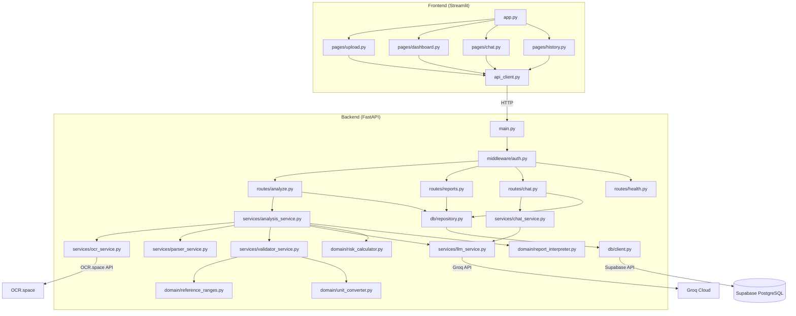

# Architecture — Health Diagnostics AI v2.0

## System Overview



## Layer Rules

| Layer | May call | Must NOT call |
|-------|----------|---------------|
| Routes | Services, Repository | Domain directly |
| Services | Domain, other Services | Routes, Repository directly (except analysis_service) |
| Domain | Nothing (pure functions) | Services, Routes, DB |
| Repository | DB Client | Services, Routes, Domain |

**Exception:** `analysis_service.py` orchestrates the full pipeline, so it calls multiple services.

## Data Flow

```
File Upload
    → OCR Service (extract text)
        → Parser Service (text → raw parameters dict)
            → Validator Service (raw params → BloodParameter objects)
                → Report Interpreter (parameters → summary + recommendations)
                → Risk Calculator (parameters → risk scores)
                → LLM Service (abnormal params → AI insights)
    → Repository (save to DB)
    → API Response (ReportResponse)
```

## Technology Stack

| Component | Technology | Why |
|-----------|-----------|-----|
| Backend framework | FastAPI | Async, auto-docs, Pydantic native |
| Frontend framework | Streamlit | Quick iteration, Python-only, migrate to Next.js later |
| LLM | Groq (Llama 3.1) | Free tier, fast inference, simple API |
| Database | Supabase (PostgreSQL) | Free tier, auth built-in, REST API |
| OCR | Tesseract + OCR.space | Local + cloud fallback |
| Validation | Pydantic v2 | Type safety, serialization, OpenAPI |
| Config | pydantic-settings | Typed env vars, validation |
| Security | slowapi, custom middleware | Rate limiting, API key auth |
| Deployment | Docker → Render | Free hosting (blueprint with 2 services) |
