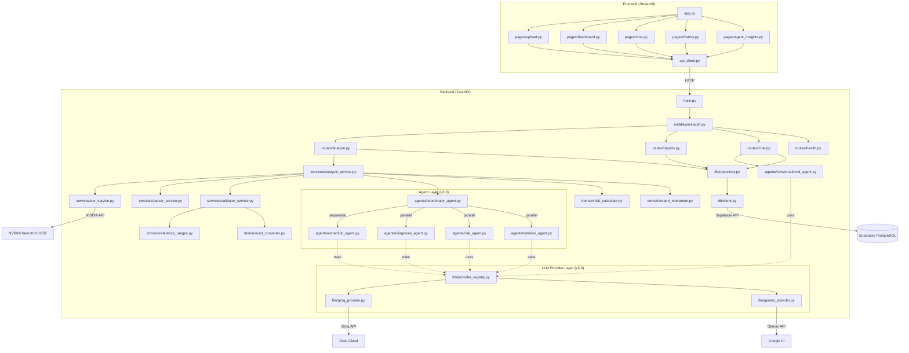
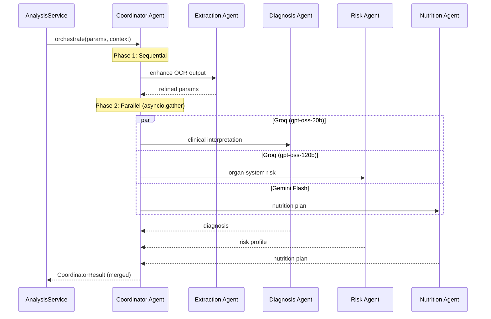

# Architecture — Health Diagnostics AI v3.0

## System Overview



## Multi-Agent Architecture

The system uses a **Coordinator Pattern** where a master agent delegates to specialist agents:



### Agents

| Agent | Role | Preferred Model | Fallback |
|-------|------|-----------------|----------|
| **Extraction Agent** | Enhance/fix OCR-parsed parameters via LLM | Gemini Flash | Returns regex-parsed params unchanged |
| **Diagnosis Agent** | Clinical interpretation, pattern analysis | Groq gpt-oss-20b | Rule-based grouping by status |
| **Risk Agent** | Organ-system risk breakdown | Groq gpt-oss-120b | Rule-based organ-group scoring |
| **Nutrition Agent** | Personalized diet/lifestyle recommendations | Gemini Flash | Parameter-to-advice mapping |
| **Conversational Agent** | Context-aware Q&A with access to all agent reports | Groq gpt-oss-20b | Simple keyword-based responses |
| **Coordinator Agent** | Dispatches agents, merges results | N/A (orchestrator) | Runs all agents, handles partial failures |

### API Key → Model Mapping

**One API key per provider gives access to ALL models from that provider:**

| API Key | Provider | Models Available |
|---------|----------|-----------------|
| `GROQ_API_KEY` | Groq | gpt-oss-20b, gpt-oss-120b, groq/compound, and more |
| `GEMINI_API_KEY` | Google Gemini | gemini-flash-latest, gemini-3.6-flash, and more |
| `NVIDIA_API_KEY` | NVIDIA | Nemotron OCR-v2 (not LLM — OCR only) |

## Layer Rules

| Layer | May call | Must NOT call |
|-------|----------|---------------|
| Routes | Services, Agents (ConversationalAgent), Repository | Domain directly |
| Services | Domain, Agents (via Coordinator), other Services | Routes, Repository directly |
| Agents | LLM Providers (via Registry) | Routes, Services, DB |
| Domain | Nothing (pure functions) | Services, Routes, DB, Agents |
| Repository | DB Client | Services, Routes, Domain |

## Data Flow (v3.0 Pipeline)

```
File Upload
    → Step 1: OCR Service (extract text)
        → Step 2: Parser Service (text → raw parameters dict)
            → Step 3: Extraction Agent [NEW] (LLM-enhanced extraction)
                → Step 4: Validator Service (raw params → BloodParameter objects)
                    → Step 5: Risk Calculator (parameters → risk scores)
                    → Step 6: Multi-Agent Analysis [NEW]
                        ├── Diagnosis Agent (parallel)
                        ├── Risk Agent (parallel)
                        └── Nutrition Agent (parallel)
                    → Step 7: Coordinator merges all results
    → Repository (save to DB)
    → API Response (ReportResponse)
```

## Technology Stack

| Component | Technology | Why |
|-----------|-----------|-----|
| Backend framework | FastAPI | Async, auto-docs, Pydantic native |
| Frontend framework | Streamlit | Quick iteration, Python-only |
| LLM (Primary) | Groq (gpt-oss-20b, gpt-oss-120b) | Free tier, sub-second inference |
| LLM (Secondary) | Google Gemini (flash-latest) | Free tier, long context, multimodal |
| Agent Framework | Custom (BaseAgent + Coordinator) | Lightweight, no external dependencies |
| Database | Supabase (PostgreSQL) | Free tier, auth built-in, REST API |
| OCR | NVIDIA Nemotron + Tesseract fallback | Cloud accuracy + local fallback |
| Validation | Pydantic v2 | Type safety, serialization, OpenAPI |
| Config | pydantic-settings | Typed env vars, validation |
| Security | slowapi, custom middleware | Rate limiting, API key auth |
| Deployment | Docker → Render | Free hosting (blueprint with 2 services) |

## Directory Structure

```
backend/
├── __init__.py
├── config.py                    # pydantic-settings (all env vars)
├── main.py                      # FastAPI app factory + lifespan
├── agents/                      # ── Agent Layer (v3.0) ──
│   ├── __init__.py
│   ├── agent_models.py          # AgentContext, AgentResult, CoordinatorResult
│   ├── base_agent.py            # Abstract base with LLM/fallback pattern
│   ├── coordinator_agent.py     # Master orchestrator
│   ├── extraction_agent.py      # LLM-enhanced OCR cleanup
│   ├── diagnosis_agent.py       # Clinical interpretation
│   ├── risk_agent.py            # Organ-system risk assessment
│   ├── nutrition_agent.py       # Diet/lifestyle recommendations
│   └── conversational_agent.py  # Context-aware chat (6th agent)
├── services/
│   ├── __init__.py
│   ├── llm/                     # ── LLM Provider Layer (v3.0) ──
│   │   ├── __init__.py
│   │   ├── provider_base.py     # Abstract LLMProvider interface
│   │   ├── groq_provider.py     # Groq SDK wrapper
│   │   ├── gemini_provider.py   # Google Gemini wrapper
│   │   └── provider_registry.py # Auto-discovery + fallback
│   ├── llm_service.py           # Backward-compatible facade
│   ├── analysis_service.py      # Pipeline orchestrator
│   ├── chat_service.py          # Legacy chat facade (kept for fallback; routes use ConversationalAgent)
│   ├── ocr_service.py           # NVIDIA + Tesseract OCR
│   ├── parser_service.py        # Regex-based parameter extraction
│   └── validator_service.py     # Reference range validation
├── domain/                      # Pure functions (no I/O)
│   ├── reference_ranges.py
│   ├── risk_calculator.py
│   ├── report_interpreter.py
│   └── unit_converter.py
├── models/                      # Pydantic schemas (single source of truth)
│   ├── blood_parameter.py
│   ├── report.py
│   ├── chat.py
│   └── health.py
├── routes/                      # FastAPI endpoints
│   ├── analyze.py
│   ├── reports.py
│   ├── chat.py
│   └── health.py
├── db/                          # Database layer
│   ├── client.py
│   └── repository.py
├── middleware/
│   └── auth.py
└── data/
    └── reference_ranges.json

frontend/
├── app.py
├── config.py
├── session.py
├── api_client.py
└── pages/
    ├── upload.py
    ├── dashboard.py
    ├── chat.py
    ├── history.py
    └── agent_insights.py        # NEW: Individual agent reasoning
```
